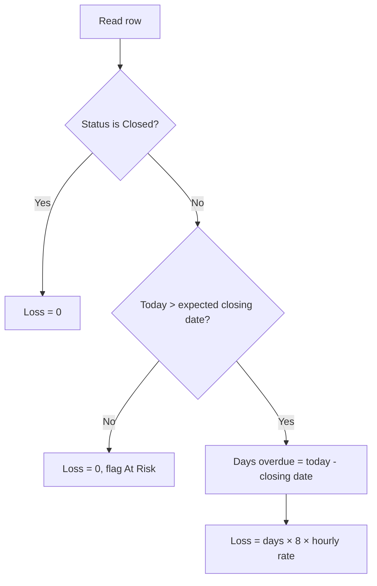

# HRM HTML Loss Report

## Data source

[hrmdata.txt](c:\Lava\project\HRM\hrmdata.txt) is CSV with columns:

`Registration number`, `grade`, `open date`, `key skill`, `expected closing date`, `negotiation status`, `hourly rate`

Sample rows include statuses: `Closed`, `In Progress`, `Open`, `On Hold`.

## Business rules (from you)


| Rule         | Definition                                                                |
| ------------ | ------------------------------------------------------------------------- |
| Onboarded    | `negotiation status` = **Closed**                                         |
| Loss trigger | Status is **not** Closed when evaluated against **expected closing date** |
| Loss amount  | **Days in loss period × 8 hours/day × hourly rate**                       |


**Loss period per row** (report “as of” date = today):




- **Closed** → no loss (treated as successfully onboarded; note: CSV has no actual close date, so we cannot detect “closed late”).
- **Not Closed** and **today ≤ closing date** → **At risk** (loss = $0, show days until deadline).
- **Not Closed** and **today > closing date** → **Loss** = `(today - closing_date).days × 8 × hourly_rate`.

## Deliverable

Add two files under `c:\Lava\project\HRM\`:

1. **[generate_report.py](c:\Lava\project\HRM\generate_report.py)** — reads `hrmdata.txt`, computes metrics, writes `report.html`.
2. **[report.html](c:\Lava\project\HRM\report.html)** — generated output (git-ignored optional; committed only if you want).

No new dependencies: use Python stdlib only (`csv`, `datetime`, `pathlib`).

## Report layout (HTML)

**Header**

- Title: HRM Resource Onboarding & Loss Report
- “As of” date and data file name

**Summary cards**

- Total registrations
- Count by status (`Closed`, `In Progress`, `Open`, `On Hold`)
- Count **At risk** (not Closed, deadline not passed)
- Count **In loss** (not Closed, past deadline)
- **Total loss** (sum of row losses)

**Detail table** (sort: highest loss first, then at-risk, then closed)


| Column               | Content                                       |
| -------------------- | --------------------------------------------- |
| Registration         | REG-…                                         |
| Grade / Skill        | From CSV                                      |
| Open / Closing dates | Formatted dates                               |
| Status               | Badge with color by status                    |
| Outcome              | `Onboarded`, `At risk`, or `Loss`             |
| Days                 | Days until deadline OR days overdue           |
| Daily burn           | `8 × hourly rate` (shown for context)         |
| Loss                 | Currency formatted; `$0` for Closed / At risk |


**Footer note** (plain language): loss assumes 8 billable hours per day from the day after the expected closing date; only `Closed` counts as onboarded.

## Styling

Embedded CSS in the HTML (no external CDN required):

- Light dashboard layout, responsive table
- Color badges: green = Closed/Onboarded, amber = At risk, red = Loss
- Print-friendly (`@media print`)

## Core logic (reference)

```python
HOURS_PER_DAY = 8
ONBOARDED = "Closed"

def outcome(status, closing_date, today):
    if status == ONBOARDED:
        return "Onboarded", 0, 0
    if today <= closing_date:
        return "At risk", (closing_date - today).days, 0
    days_overdue = (today - closing_date).days
    loss = days_overdue * HOURS_PER_DAY * hourly_rate
    return "Loss", days_overdue, loss
```

## How to run (after implementation)

```powershell
cd c:\Lava\project\HRM
python generate_report.py
```

Opens `report.html` in the browser. Re-run whenever `hrmdata.txt` changes.

## Example outcomes (with today = 2026-05-21)

All 2024 closing dates are in the past. Expected report behavior:

- **REG-2024-001, 005** (`Closed`) → Onboarded, $0 loss
- **REG-2024-002, 004, 007, 010** (`In Progress`) → Loss for hundreds of overdue days each
- **REG-2024-003, 006, 008** (`Open`) → Loss
- **REG-2024-009** (`On Hold`) → Loss

Exact dollar amounts depend on `days_overdue × 8 × rate` (e.g. REG-2024-002: ~767 days × 8 × $65).

## Limitations (documented in report)

- No “actual closed date” in data — `Closed` rows are assumed fully onboarded with zero loss even if they closed after the deadline.
- Loss is **opportunity cost** (unbilled capacity), not a separate cost model.
- Single currency; hourly rate taken as-is from CSV.

## Optional follow-ups (out of scope unless you ask)

- Add `actual closed date` column for accurate late-close detection
- Export PDF
- Filter by grade/status in the HTML

